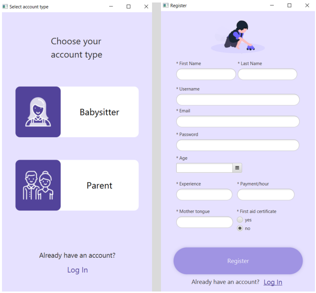

# Child Care System

Child Care System represents the 2nd-semester project for the Software Technology Engineering programme at VIA University College. The project depicts a client/server child-care system meant to connect parents with babysitters depicting separately a client and server-side application implemented through RMI and written in Java and JavaFX alongside with a PostgreSQL database for back-end storage.

The goal of the case idea is to create a simple booking system that allows parents to view a list of potential babysitters, book any babysitter services, and receive notifications.
